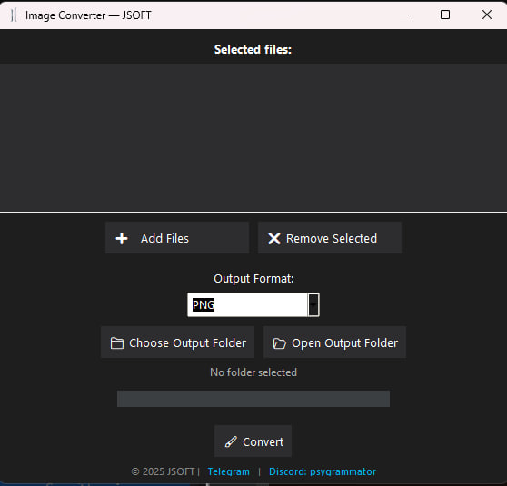

# 🖼️ ImageConverterGUI

**ImageConverterGUI** is a modern desktop application by [@psygrammator](https://t.me/psygrammator), designed for effortlessly converting images between formats such as HEIC, JPEG, PNG, BMP, WebP, and TIFF. It features drag-and-drop support and a stylish dark interface based on the Copylot theme.



## 💡 Features

- Supported formats: `.heic`, `.jpg`, `.jpeg`, `.png`, `.webp`, `.bmp`, `.tiff`
- Convert to: **PNG, JPEG, WebP, BMP, TIFF**
- Drag & Drop interface
- Output format selection
- Select output folder
- Conversion progress bar
- Button to open the output folder
- Windows compatible
- Modern Copylot Dark Theme interface

## 🚀 Installation & Launch

### 🔧 Build EXE

> Requires Python 3.10+, PyInstaller, and dependencies from `requirements.txt`

```bash
git clone https://github.com/psygrammator/ImageConverterGUI.git
cd ImageConverterGUI
pip install -r requirements.txt
build.bat
```

📦 Run  
After building, run: `dist/ImageConverterGUI.exe`

🧱 Dependencies  
- `tkinter`  
- `tkinterdnd2`  
- `pillow`  
- `pillow-heif`

📁 Project Structure

```
├── images_converter_gui.py   # main GUI file  
├── icon.ico                  # application icon  
├── azure-dark.tcl            # Copylot Dark Theme  
├── build.bat                 # build script  
├── images_converter_gui.spec # PyInstaller config  
├── README.md  
└── .gitignore
```

🤝 Contacts  
Telegram: [@psygrammator](https://t.me/psygrammator)  
Discord: psygrammator (ID: 830176153029050368)

📝 License  
MIT License © 2025 psygrammator

---

I can also generate:
- `.gitignore`
- `requirements.txt`
- `preview.png` (if you send the screenshot)
- `build.bat` (already created — I can reattach)

Ready when you are.


# RU
# 🖼️ ImageConverterGUI

**ImageConverterGUI** — это современное настольное приложение от [@psygrammator](https://t.me/psygrammator), позволяющее легко конвертировать изображения из различных форматов, включая HEIC, JPEG, PNG, BMP, WebP и TIFF, с поддержкой drag-and-drop и темной темы в стиле Copylot.


## 💡 Возможности

- Поддержка форматов: `.heic`, `.jpg`, `.jpeg`, `.png`, `.webp`, `.bmp`, `.tiff`
- Конвертация в: **PNG, JPEG, WebP, BMP, TIFF**
- Drag & Drop интерфейс
- Выбор формата вывода
- Указание конечной папки сохранения
- Прогрессбар выполнения
- Кнопка «Открыть папку»
- Совместимость с Windows
- Современный интерфейс (Copylot Dark Theme)

## 🚀 Установка и запуск

### 🔧 Сборка EXE

> Требуется Python 3.10+, PyInstaller и зависимости из `requirements.txt`

```bash
git clone https://github.com/psygrammator/ImageConverterGUI.git
cd ImageConverterGUI
pip install -r requirements.txt
build.bat

📦 Запуск
После сборки, запускайте dist/ImageConverterGUI.exe.

🧱 Зависимости
tkinter

tkinterdnd2

pillow

pillow-heif

📁 Структура проекта

├── images_converter_gui.py   # основной файл GUI
├── icon.ico                  # иконка программы
├── azure-dark.tcl            # Copylot Dark Theme
├── build.bat                 # сборка в .exe
├── images_converter_gui.spec # PyInstaller конфигурация
├── README.md
└── .gitignore

🤝 Контакты
Telegram: @psygrammator

Discord: psygrammator (ID: 830176153029050368)

📝 Лицензия
MIT License © 2025 psygrammator


---

Если хочешь, я могу также сразу сгенерировать:
- `.gitignore`
- `requirements.txt`
- `preview.png` (если отправишь скрин)
- `build.bat` (уже создавали ранее — могу продублировать)

Готов продолжать.
